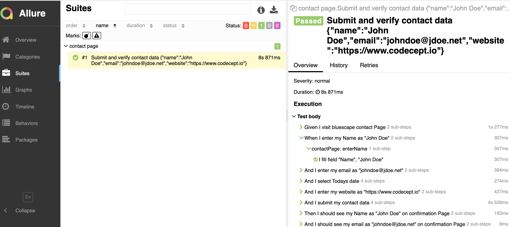

# CodeceptJS 
Sample for codeceptJS

## Getting Started

### Prerequisites

Node.js installed (https://nodejs.org/en/)

Java 8 or higher (reporting allure)

### Installing

run `npm install`

run `npm install -g allure-commandline --save-dev` for allure report plugin

## Running the tests
Basic Run : `npx codeceptjs run --steps`

Allure Plugin report : `npx codeceptjs run --plugins allure`

view test report : `allure serve output`

### Test Framework

- Feature file 
- Steps file 
- Page model 

### Test Files

    contactPage_test.feature

## Reporter
    Allure
 
